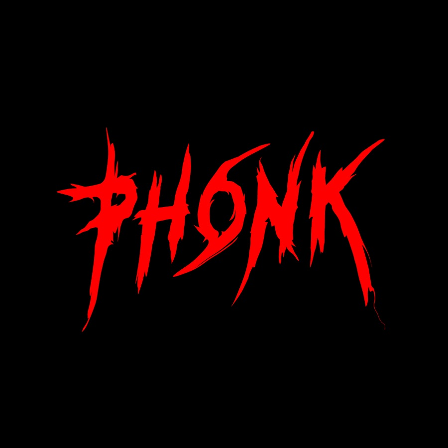

```{r}
library(tidyverse)
library(spotifyr)
library(flexdashboard)
library(ggplot2)
library(plotly)
library(compmus)

Sys.setenv(SPOTIFY_CLIENT_ID="34c9d0d698064bf886a78b343db5445b")
Sys.setenv(SPOTIFY_CLIENT_SECRET="d0e93595f1ee411bb21938c5cb50d247")

access_token <- get_spotify_access_token()

pop <- get_playlist_audio_features("", "2AipD5zTjWWM13wk2hZmej")
phonk <- get_playlist_audio_features("", "37i9dQZF1DWWY64wDtewQt")
rap <- get_playlist_audio_features("", "37i9dQZF1DX76t638V6CA8")

awards <-
  bind_rows(
    pop |> mutate(category = "Pop"),
    phonk |> mutate(category = "Phonk"),
    rap |> mutate(category = "Rap")
    
  )
```

Introduction {.storyboard data-icon="ion-ios-home"}
=========================================


### Exploring the Unique Sounds: A Comparison of Three Distinct Music Genres
<font style="font-size: 30px">My Corpus choice</font>

My corpus consists of a collection of songs from various genres including mainly Pop, Rap, and Phonk (which is a sub genre of hip hop and
trap music). This corpus was chosen because I want to explore the differences and similarities among these various genres in terms of
their musical characteristics. Initially these three main genres within my corpus seem very different, so I thought it would be
interesting to see if there were any specific overlapping musical characteristics which makes them so compelling for my taste in music. Something interesting to keep in mind: I personally listen to these different genres under various circumstances. For example I tend to listen mostly to Pop when studying, while when working out I like to listen to Rap to give me that extra energy, and finally when gaming I tend to listen mostly to Phonk to focus in a game.

<font style="font-size: 30px">Comparisons</font>

The natural comparison points in my corpus are therefore the different genres: Pop, Rap, and Phonk. I expect to see differences in terms
of rhythm, melody, harmony, and lyrics. For example, I expected Pop music to have a more upbeat rhythm and catchy lyrics compared to Rap
music which might have a heavier beat and very different flowing lyrics. However, I also expected to see some similarities across genres,
for example Rap and Phonk often seem to have a similar type beat and rhythm: heavy and fast paced. It will be interesting to explore the
similarity and differences regarding the instruments and music keys/notes used in typical songs of each genre.

The tracks in my corpus are representative of the groups I want to compare, as I selected them based on their popularity and mainstream
recognition within each genre. However, it is possible that my corpus might not cover all sub-genres within each main genre, and therefore
may not represent the full scope of each genre.

Some examples of typical tracks in my corpus are "Invincible" by Pop Smoke, a popular Rap/Hiphop song, and "Counting Stars" by
OneRepublic, a popular Pop song with its iconic vocal harmonies and theatrical elements. Atypical tracks in my corpus include "Sweater
Weather" by the Neighbourhood, which is a mix between Indie rock and alternative rock, and "break from toronto" by PartyNextDoor, which
could be classified as R&B or Hiphop but also contains a form of rap. These atypical songs may cause there to be some outliers in the data.
These outliers may have to be filtered out first in order to be able to make the most fair comparison for each genre.

In conclusion, this portfolio will focus on exploring and analyzing the musical characteristics of Pop, Rap, and Phonk, to find out what
makes them appealing to listen to under various circumstances.

***

```{r picture, echo = F,  out.width = '100%'}
knitr::include_graphics("pics/pop.jpg")
knitr::include_graphics("pics/rap.jpg")

# "pop vs dddd"
```


Visual analysis of my corpus {.storyboard data-icon="fa-signal"}
=========================================
### Keys & Genre
```{r}
p <- awards %>% 
  ggplot(aes(x = key_name, fill = key_name)) +
  geom_bar() +
  facet_wrap(~category) +
  ggtitle("Distribution of keys per genre")

ggplotly(p)
```

***

This bar chart gives a good representation of the differences in key usage between the three genres. Something interesting to look at is the most used key for example, both Phonk and Rap make use of the C# key the most. However it seems that in Rap songs, this key is used almost twice as much as any other key on average, while in Phonk is seems to be relatively balanced with the other keys. It is also interesting to see that Phonk does not have a single instance of the D# key. Finally we can clearly see that out of the three genres, Pop seems to have the most balanced distribution of key usage since it uses all keys and does not really have one major outstanding key.


### Ineractive Energy & Valence
```{r}
p <- awards %>%                    # Start with awards.
  ggplot(                     # Set up the plot.
    aes(
      x = valence,
      y = energy,
      size = loudness,
      colour = energy
    )
  ) +
  geom_point() +              # Scatter plot.
  geom_rug(linewidth = 0.2) + # Add 'fringes' to show data distribution.

facet_wrap(~ category) +    # Separate charts per playlist.
  scale_x_continuous(         # Fine-tune the x axis.
    limits = c(0, 1),
    breaks = c(0, 0.50, 1),   # Use grid-lines for quadrants only.
    minor_breaks = NULL       # Remove 'minor' grid-lines.
  ) +
  scale_y_continuous(         # Fine-tune the y axis in the same way.
    limits = c(0, 1),
    breaks = c(0, 0.50, 1),
    minor_breaks = NULL
  ) +
  scale_size_continuous(      # Fine-tune the sizes of each point.
    trans = "exp",            # Use an exp transformation to emphasise loud.
    guide = "none"            # Remove the legend for size.
  ) +
  theme_light() +             # Use a simpler theme.
  labs(                       # Make the titles nice.
    x = "Valence",
    y = "Energy",
  ) + ggtitle("Relationship between loudness, energy and valence in Phonk, Rap & Pop")

ggplotly(p)
```

***

For this second plot I decided to compare the valence and energy of The three genres: Pop, Rap and Phonk. Since I wanted to see if there was any correlation between the valence of and the energy of songs. I expected the Pop genre to have the highest average valence out of the three genres, since these songs are often linked to positive vibes. And Phonk to have the highest energy values on average, since this genre is associated with fast, loud and noisy music (as can be seen in the plot where bigger points indicate louder songs). Therefore it was no surprise to see that pop had indead a relatively high valence and Phonk had a relatively high energy. However I was surprised to find out that the Phonk genre actually also scored relatively high on average for valence too, since I assumed this fast and loud type of music would give off an angry vibe. This shows that there could be a correlation between the valence and energy of songs.


### Dancebility

```{r}
p <- awards %>%
  ggplot(aes(x = category, y = danceability, fill = category)) +
  geom_boxplot(alpha = 0.7) +
  scale_fill_brewer(palette="PuRd") +
  ggtitle("Dancebility: Phonk vs Pop vs Rap")

ggplotly(p)
```

***

This boxplot shows that interestingly enough, rap seems to have the highest danceability value on average according to spotify's measure. I would personally have guessed that Pop songs would have the highest danceability by a mile, so seeing Pop not scoring as high surprised me. I wonder what makes a song danceable by defenition of spotify, it would be interesting to see the exact features of this.


### Chromatograms

<!-- #### Pop: "Counting Stars" by "OneRepublic" -->
<font style="font-size: 25px">Pop: "Counting Stars" by "OneRepublic"</font>

```{r chroma_pop}

wood <-
  get_tidy_audio_analysis("2tpWsVSb9UEmDRxAl1zhX1") |>
  select(segments) |>
  unnest(segments) |>
  select(start, duration, pitches)
wood |>
  mutate(pitches = map(pitches, compmus_normalise, "euclidean")) |>
  compmus_gather_chroma() |>
  ggplot(
    aes(
      x = start + duration / 2,
      width = duration,
      y = pitch_class,
      fill = value
    )
  ) +
  geom_tile() +
  labs(x = "Time (s)", y = NULL, fill = "Magnitude") +
  theme_minimal() +
  scale_fill_viridis_c(option = "mako")
```

<!-- #### Phonk: "Close Eyes" by "DVRST" -->
<font style="font-size: 25px">Phonk: "Close Eyes" by "DVRST"</font>

```{r chroma_phonk}

wood <-
  get_tidy_audio_analysis("3CLSHJv5aUROAN2vfOyCOh") |>
  select(segments) |>
  unnest(segments) |>
  select(start, duration, pitches)
wood |>
  mutate(pitches = map(pitches, compmus_normalise, "euclidean")) |>
  compmus_gather_chroma() |>
  ggplot(
    aes(
      x = start + duration / 2,
      width = duration,
      y = pitch_class,
      fill = value
    )
  ) +
  geom_tile() +
  labs(x = "Time (s)", y = NULL, fill = "Magnitude") +
  theme_minimal() +
  scale_fill_viridis_c(option = "mako")
```

<!-- #### Rap: "Invincible" by "Pop Smoke" -->
<font style="font-size: 25px">Rap: "Invincible" by "Pop Smoke"</font>

```{r chroma_rap}

wood <-
  get_tidy_audio_analysis("792HwhrdO3ErRKL5yRe4Ge") |>
  select(segments) |>
  unnest(segments) |>
  select(start, duration, pitches)
wood |>
  mutate(pitches = map(pitches, compmus_normalise, "euclidean")) |>
  compmus_gather_chroma() |>
  ggplot(
    aes(
      x = start + duration / 2,
      width = duration,
      y = pitch_class,
      fill = value
    )
  ) +
  geom_tile() +
  labs(x = "Time (s)", y = NULL, fill = "Magnitude") +
  theme_minimal() +
  scale_fill_viridis_c(option = "mako")
```

***

The Chromatogram shows that for the Pop song: "Counting Stars" by "OneRepublic", the C# key has the longest time use by far and it seems that the C key comes second. The rest of the keys do not seem to get much playtime in comparison.

The Chromatogram shows that for the Pop song: "Close Eyes" by "DRVST", the C key has the longest time use by far and it seems that the C#, F and E keys follow regarding playtime. The rest of the keys do not seem to get much playtime in comparison.

The Chromatogram shows that for the Pop song: "Invincible" by "Pop Smoke", the F# key has the longest time use by far, all the other keys do not even come close to having as much playtime.

Interestingly there seems to be some overlap between Pop and Phonk specific songs, whereby both genres seem to have the most playtime of the C and C# keys while the A#, A, D#, D keys all seem to have not much playtime. Furthermore it looks like the Rap song also makes the least use of the A# and D# keys, however these are the only comparable points since the F# key is being used the longest by far and the rest of keys being almost equally distributed.


### Cepstrograms

<!-- #### Pop: "Counting Stars" by "OneRepublic" -->
<font style="font-size: 25px">Pop: "Counting Stars" by "OneRepublic"</font>

```{r timbre_pop}
# Cepstrograms
bzt <-
  get_tidy_audio_analysis("2tpWsVSb9UEmDRxAl1zhX1") |> # Change URI.
  compmus_align(bars, segments) |>                     # Change `bars`
  select(bars) |>                                      #   in all three
  unnest(bars) |>                                      #   of these lines.
  mutate(
    pitches =
      map(segments,
          compmus_summarise, pitches,
          method = "rms", norm = "euclidean"              # Change summary & norm.
      )
  ) |>
  mutate(
    timbre =
      map(segments,
          compmus_summarise, timbre,
          method = "rms", norm = "euclidean"              # Change summary & norm.
      )
  )
bzt |>
  compmus_gather_timbre() |>
  ggplot(
    aes(
      x = start + duration / 2,
      width = duration,
      y = basis,
      fill = value
    )
  ) +
  geom_tile() +
  labs(x = "Time (s)", y = NULL, fill = "Magnitude") +
  scale_fill_viridis_c() +                              
  theme_classic()+
  ggtitle("Timbre")+
  theme(plot.title = element_text(hjust = 0.5))
# SELF SIMILARITY MATRIX
bzt |>
  compmus_self_similarity(timbre, "cosine") |> 
  ggplot(
    aes(
      x = xstart + xduration / 2,
      width = xduration,
      y = ystart + yduration / 2,
      height = yduration,
      fill = d
    )
  ) +
  geom_tile() +
  coord_fixed() +
  scale_fill_viridis_c(guide = "none") +
  theme_classic() +
  labs(x = "", y = "")+
  ggtitle("Timbre")+
  theme(plot.title = element_text(hjust = 0.5))
```

<!-- #### Phonk: "Close Eyes" by "DVRST" -->
<font style="font-size: 25px">Phonk: "Close Eyes" by "DVRST"</font>

```{r timbre_phonk}
# Cepstrograms
bzt <-
  get_tidy_audio_analysis("3CLSHJv5aUROAN2vfOyCOh") |> # Change URI.
  compmus_align(bars, segments) |>                     # Change `bars`
  select(bars) |>                                      #   in all three
  unnest(bars) |>                                      #   of these lines.
  mutate(
    pitches =
      map(segments,
          compmus_summarise, pitches,
          method = "rms", norm = "euclidean"              # Change summary & norm.
      )
  ) |>
  mutate(
    timbre =
      map(segments,
          compmus_summarise, timbre,
          method = "rms", norm = "euclidean"              # Change summary & norm.
      )
  )
bzt |>
  compmus_gather_timbre() |>
  ggplot(
    aes(
      x = start + duration / 2,
      width = duration,
      y = basis,
      fill = value
    )
  ) +
  geom_tile() +
  labs(x = "Time (s)", y = NULL, fill = "Magnitude") +
  scale_fill_viridis_c() +                              
  theme_classic()+
  ggtitle("Timbre")+
  theme(plot.title = element_text(hjust = 0.5))
# SELF SIMILARITY MATRIX
bzt |>
  compmus_self_similarity(timbre, "cosine") |> 
  ggplot(
    aes(
      x = xstart + xduration / 2,
      width = xduration,
      y = ystart + yduration / 2,
      height = yduration,
      fill = d
    )
  ) +
  geom_tile() +
  coord_fixed() +
  scale_fill_viridis_c(guide = "none") +
  theme_classic() +
  labs(x = "", y = "")+
  ggtitle("Timbre")+
  theme(plot.title = element_text(hjust = 0.5))
```

<!-- #### Rap: "Invincible" by "Pop Smoke" -->
<font style="font-size: 25px">Rap: "Invincible" by "Pop Smoke"</font>


```{r timbre_rap}
# Cepstrograms
bzt <-
  get_tidy_audio_analysis("792HwhrdO3ErRKL5yRe4Ge") |> # Change URI.
  compmus_align(bars, segments) |>                     # Change `bars`
  select(bars) |>                                      #   in all three
  unnest(bars) |>                                      #   of these lines.
  mutate(
    pitches =
      map(segments,
          compmus_summarise, pitches,
          method = "rms", norm = "euclidean"              # Change summary & norm.
      )
  ) |>
  mutate(
    timbre =
      map(segments,
          compmus_summarise, timbre,
          method = "rms", norm = "euclidean"              # Change summary & norm.
      )
  )
bzt |>
  compmus_gather_timbre() |>
  ggplot(
    aes(
      x = start + duration / 2,
      width = duration,
      y = basis,
      fill = value
    )
  ) +
  geom_tile() +
  labs(x = "Time (s)", y = NULL, fill = "Magnitude") +
  scale_fill_viridis_c() +                              
  theme_classic()+
  ggtitle("Timbre")+
  theme(plot.title = element_text(hjust = 0.5))
# SELF SIMILARITY MATRIX
bzt |>
  compmus_self_similarity(timbre, "cosine") |> 
  ggplot(
    aes(
      x = xstart + xduration / 2,
      width = xduration,
      y = ystart + yduration / 2,
      height = yduration,
      fill = d
    )
  ) +
  geom_tile() +
  coord_fixed() +
  scale_fill_viridis_c(guide = "none") +
  theme_classic() +
  labs(x = "", y = "")+
  ggtitle("Timbre")+
  theme(plot.title = element_text(hjust = 0.5))
```

***

The plots show the changes regarding timbre of typical songs from each genre: Pop, Phonk and Rap...


What did I find {.storyboard data-icon="ion-music-note"}
=========================================

### Conclusion


### Discussion
